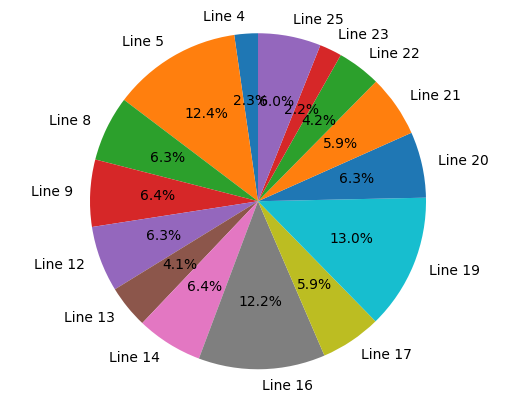
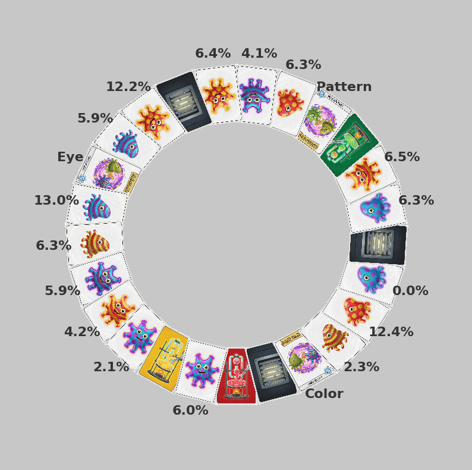

# Panic Lab Simulator & Renderer

Monte Carlo helper that recreates the [Panic Lab](https://en.gigamic.com/family-games/81-panic-lab.html) board, runs thousands of virtual experiments, and turns the results into quick visuals. Use it to sanity-check a custom card ring, practice spotting amoebas, or simply enjoy the art.

## Features
- Parse a human-friendly `input.txt` that describes the circular card layout (labs, vents, evolution cards, amoebas).
- Run configurable experiments (`main.py`) to estimate each amoeba's chance of being the first match that a seeker would find.
- Render the win-rate pie chart plus a top-down board view (`render_art.py`) with enlarged labels, evolution hints, and customizable assets.

## Getting Started
1. **Python**: 3.10+ is recommended (for type hints and newer stdlib features).
2. **Install deps**:
   ```bash
   python -m venv .venv
   source .venv/bin/activate
   pip install matplotlib pillow numpy
   ```
3. **Run simulations** (both text + plots):
   ```bash
   python main.py -i input.txt -n 20000 --seed 42
   ```
   - Use `--no-plot` if you only want terminal output.
   - Adjust `-n/--experiments` for more precision (defaults to 10,000).
4. **Render art directly** (if you only need updated PNGs and already collected `points` from a previous run):
   ```bash
   python render_art.py -i input.txt --seed 99 --board-output board.png --pie-output results.png
   ```
   Flags such as `--skip-pie`, `--skip-board`, or `--assets-dir` help automate export workflows.

## Visualizations

### Pie Chart (Amoeba Win Rates)


### Circular Board Snapshot


## Input Format
Each non-empty line describes one card, evaluated in order around the ring. Comments (`# ...`) and blank lines are ignored.

```
lab red
vent
evolution color
amoeba red strip single
amoeba blue dot double
```

Supported tokens:
- `lab <red|green|yellow>`
- `vent`
- `evolution <color|pattern|eye>`
- `amoeba <color> <pattern> <eye>` where `color ∈ {red, blue}`, `pattern ∈ {strip|striped, dot|dotty}`, `eye ∈ {single|1, double|2}`.

See `input.txt` for a full example.

## Labels and Assets
- **Assets**: Drop replacement PNGs in `assets/`. Naming convention follows `<color>_<pattern>_<eye>.png` for amoebas, `lab_<color>.png` for start cards, and `evolution_{color|pattern|eye}.png` for mutation cards.
- **Evolution labels**: The board render displays `Color`, `Pattern` or `Eye` thereof next to each evolution card so you can spot what mutates along the path.

## Repository Layout
```
.
├── assets/                # Card art and icons used by the renderer
├── card.py                # Card hierarchy and configuration logic
├── parser.py              # Input parsing helpers
├── simulator.py           # Monte Carlo engine + routing helpers
├── render_art.py          # Pie chart and board visualizations
├── main.py                # CLI entry point (parses, simulates, renders)
├── input.txt              # Example card ring definition
├── board.png              # Latest circular board render
└── results.png            # Latest win-rate pie chart
```

Happy hunting!
